<div align="center">
  

  # AUTORA

  ### Automotive service management — from booking to delivery

  A production-style Django platform with a public website, anonymous customer cabinet,
  staff workspace, estimates, in-app updates, and system administration.

  <br>

  **[Open live demo](https://autora-service.onrender.com/)**
  &nbsp;&nbsp;·&nbsp;&nbsp;
  **[Customer cabinet](https://autora-service.onrender.com/client/)**
  &nbsp;&nbsp;·&nbsp;&nbsp;
  **[CI status](https://github.com/webnix-technologygroup/autora-service/actions/workflows/ci.yml)**

  <br>

  `Django 5.2` &nbsp; `Python` &nbsp; `PostgreSQL` &nbsp; `Neon` &nbsp; `Render` &nbsp; `Gunicorn`
</div>

<br>
<br>

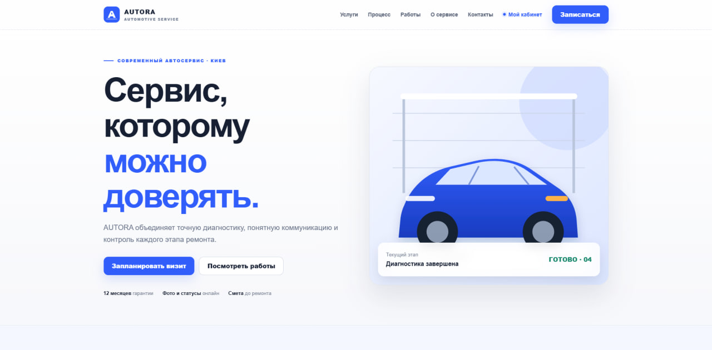

<p align="center"><sub>Public website · clear positioning, service discovery, and online booking</sub></p>

<br>

## The idea

AUTORA demonstrates how a real automotive workshop can connect its customer journey and internal operations in one product.

A customer submits a request and receives a private order number. That number opens an anonymous browser-based cabinet—no registration, social login, or password required. Workshop staff process the same order in a dedicated operational interface, while Django Admin remains available for system-level management.

```text
Booking  →  Customer cabinet  →  Workshop processing  →  Estimate approval  →  Delivery
```

> All seeded customers, vehicles, orders, prices, and contact details are fictional portfolio data.

<br>

# 01 — Public experience

## Services that are easy to understand

The public website presents the workshop without generic dashboard UI. Services, process, examples, guarantees, and contacts are designed as one coherent brand experience.

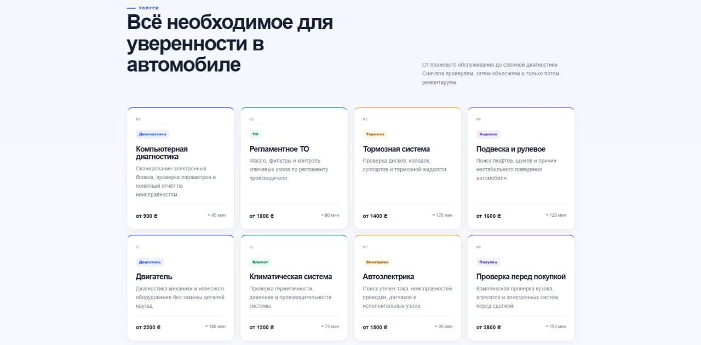

<p align="center"><sub>Service catalogue with clear categories, pricing cues, and visual hierarchy</sub></p>

<br>

## Booking without friction

The booking form validates contact and vehicle information, protects against duplicate submissions, supports attachments, and rate-limits abuse.

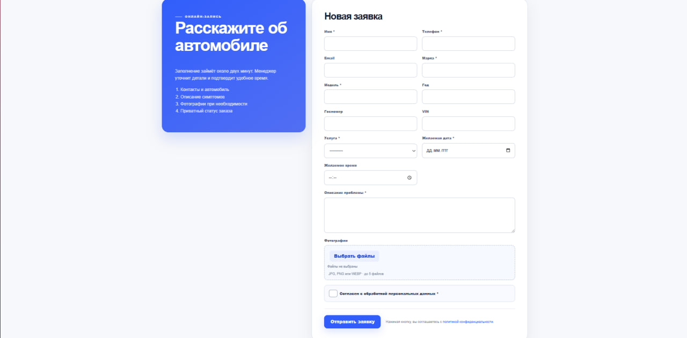

<p align="center"><sub>A focused request form built for a real service workflow</sub></p>

<br>

## A useful success state

After submission, the customer receives an order number and a clear next step instead of a generic confirmation message.

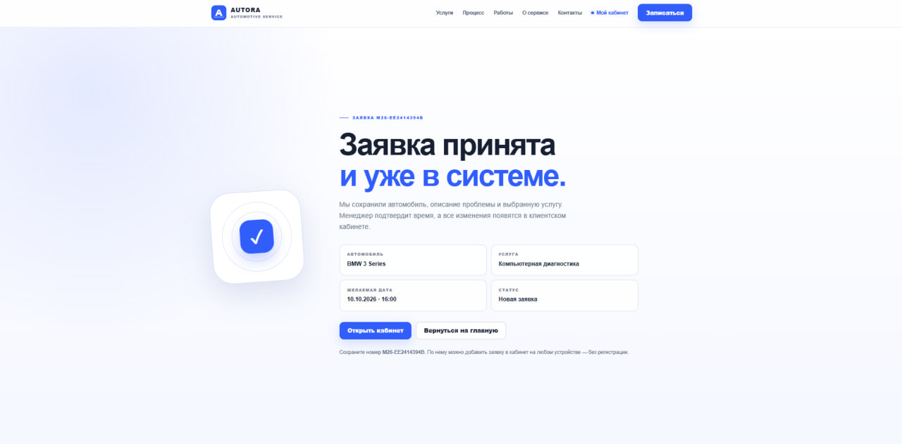

<p align="center"><sub>Successful submission with the private order number and cabinet entry point</sub></p>

<br>
<br>

# 02 — Customer cabinet

## No account. Still personal.

The cabinet uses a secure Django session rather than a traditional user account. Customers add orders by number, keep several orders in the same browser, and remove them whenever they want.

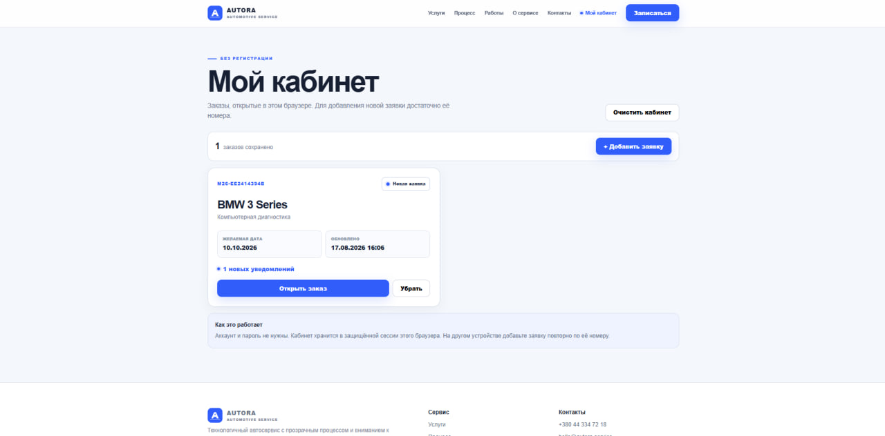

<p align="center"><sub>Multiple orders, current statuses, update counters, and quick actions</sub></p>

<br>

## Everything important in one order view

The customer can follow progress, review the schedule and estimate, approve work, see workshop photos, and read customer-visible events.

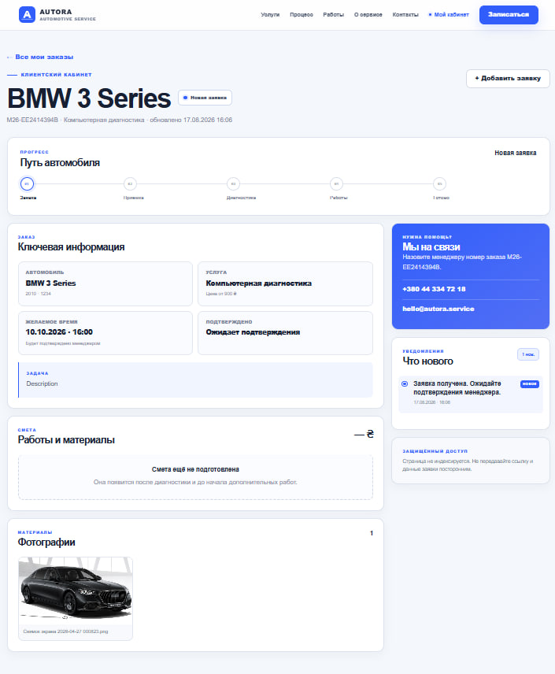

<p align="center"><sub>Order progress, estimate, history, and in-app notifications</sub></p>

### Customer flow

- Submit a service request.
- Receive a private order number.
- Add the order to the cabinet.
- Follow status and schedule changes.
- Review and approve the estimate.
- Read new workshop updates.

The browser receives only a secure session cookie. Order access metadata remains server-side and is never stored directly in `localStorage`.

<br>
<br>

# 03 — Staff workspace

## Designed for daily operations

The staff area is not a recolored Django Admin. It is a separate workspace for the people processing orders every day.

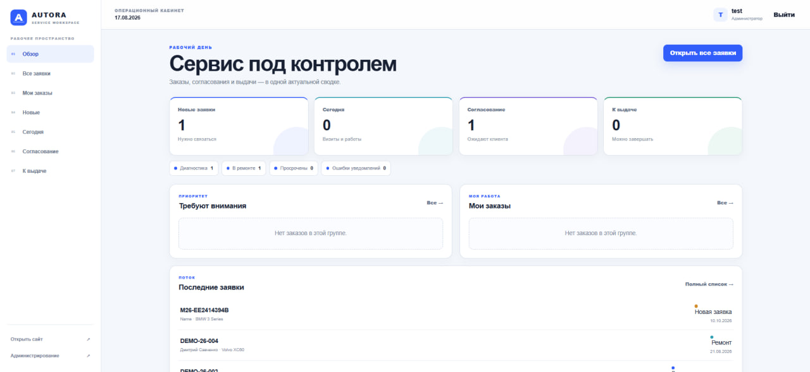

<p align="center"><sub>Workshop overview with operational metrics and current workload</sub></p>

<br>

## A queue that stays readable

Orders can be searched, filtered, assigned, and opened without losing the operational context.

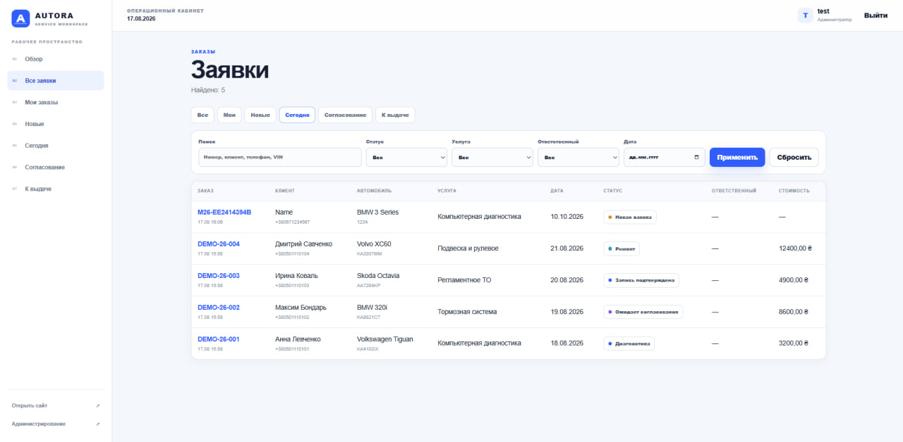

<p align="center"><sub>Searchable order queue with status and responsibility visibility</sub></p>

<br>

## One workspace per order

Scheduling, responsibility, status, estimate items, approval, comments, and event history live together.

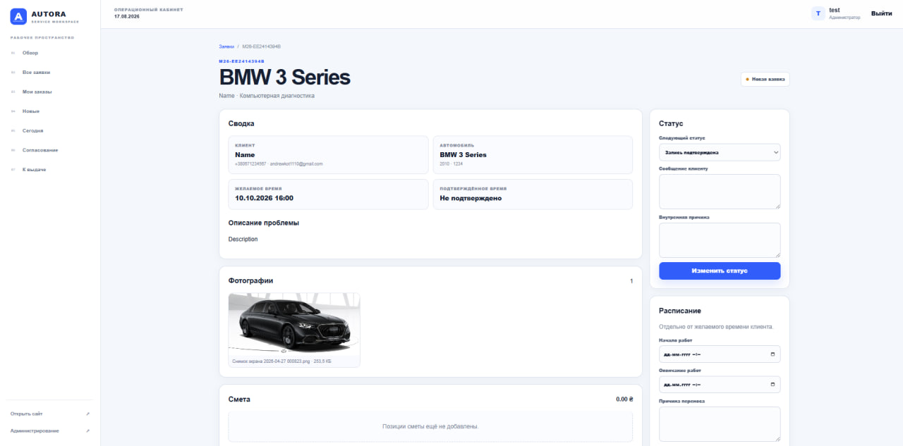

<p align="center"><sub>Operational order workspace for service advisors and workshop staff</sub></p>

### Staff capabilities

- Role-based access to orders and operations
- Staff assignment and appointment scheduling
- Controlled status transitions
- Estimate lines, totals, and approval state
- Internal comments and public progress events
- Client access-link management
- Notification visibility and retry controls

<br>
<br>

# 04 — System administration

Django Admin is reserved for system-level work: services, customers, vehicles, orders, access links, events, estimates, and notification records.

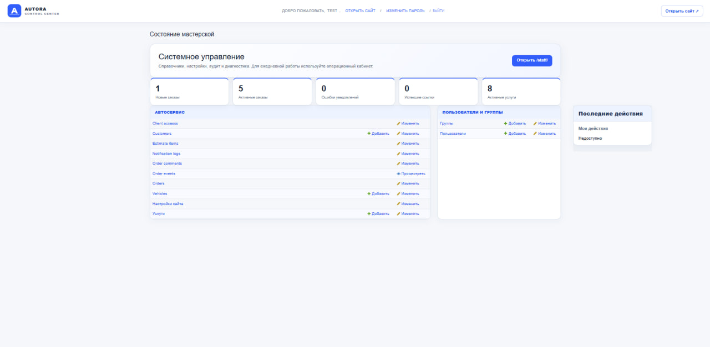

<p align="center"><sub>A customized administration experience consistent with the AUTORA product</sub></p>

Superusers are created only through Django's standard command:

```bash
python manage.py createsuperuser
```

`seed_demo` never creates users, groups, passwords, or hidden administrator accounts.

<br>
<br>

# 05 — Responsive by design

The public website, customer cabinet, and staff workspace were designed for mobile use—not simply scaled down after the desktop version.

<p align="center">
  
  &nbsp;
  
  &nbsp;
  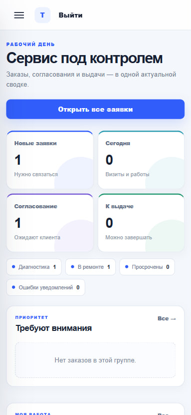
</p>

<p align="center"><sub>Public website &nbsp;·&nbsp; Customer cabinet &nbsp;·&nbsp; Staff workspace</sub></p>

Mobile behavior includes an animated navigation drawer, touch-friendly controls, stacked data layouts, readable forms, and no horizontal overflow.

<br>
<br>

# 06 — Finished states matter

Production polish also includes branded error handling. The project provides dedicated 403, 404, and 500 experiences instead of exposing Django defaults.

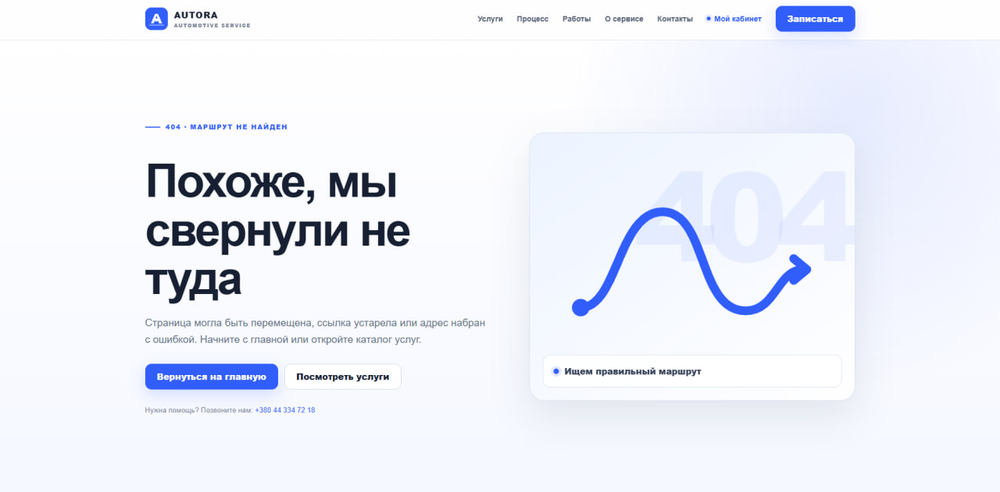

<p align="center"><sub>Custom error experience that keeps users inside the product</sub></p>

<br>
<br>

# Engineering

## Stack

- **Backend:** Python, Django 5.2
- **Database:** PostgreSQL on Neon
- **Application server:** Gunicorn
- **Static assets:** WhiteNoise with compressed manifest storage
- **Frontend:** Django templates, semantic HTML, CSS, vanilla JavaScript, SVG
- **Deployment:** Render Web Service
- **Automation:** GitHub Actions
- **Authentication:** Django auth for staff; anonymous server-side sessions for customers

## Architecture

```text
                         ┌─ Public website
Browser ── HTTPS ──►     ├─ Customer cabinet
                         ├─ Staff workspace
                         └─ Django Admin
                                  │
                                  ▼
                     Django + Gunicorn on Render
                         │                  │
                         │                  └─ WhiteNoise static assets
                         │
                         └─ TLS / sslmode=require ──► Neon PostgreSQL
```

## Security choices

- CSRF cookie and form-token validation for unsafe requests
- Trusted-origin validation and safe same-origin handling on Render
- Secure, HttpOnly, SameSite session cookies
- HTTPS redirect, HSTS, CSP, frame denial, and MIME protection
- Authorization-checked private media endpoints
- Rate limits for booking and order lookup
- Server-side anonymous cabinet state
- Production secrets loaded only from environment variables
- Startup validation rejects placeholders and weak production values

<br>

# Try the demo

**Live:** https://autora-service.onrender.com/

Add any of these fictional orders to the customer cabinet:

```text
DEMO-26-001
DEMO-26-002
DEMO-26-003
DEMO-26-004
```

A phone number is not required. Public staff and admin credentials are intentionally not included.

<br>

# Run locally

## Windows PowerShell

```powershell
git clone https://github.com/webnix-technologygroup/autora-service.git
cd autora-service

py -m venv .venv
Set-ExecutionPolicy -Scope Process -ExecutionPolicy Bypass
.\.venv\Scripts\Activate.ps1

python -m pip install --upgrade pip
python -m pip install -r requirements.txt

$env:DJANGO_ENV="development"
$env:DJANGO_DEBUG="1"
$env:DJANGO_ALLOWED_HOSTS="localhost,127.0.0.1,testserver"
$env:PUBLIC_BASE_URL="http://127.0.0.1:8000"
$env:CLIENT_TOKEN_ENCRYPTION_KEYS="local-development-encryption-key-change-me"
$env:EMAIL_ENABLED="0"
$env:SECURE_SSL_REDIRECT="0"
$env:TRUST_PROXY_HEADERS="0"
$env:TIME_ZONE="Europe/Kyiv"

python manage.py migrate
python manage.py seed_demo
python manage.py createsuperuser
python manage.py runserver
```

Open `http://127.0.0.1:8000/`.

<details>
<summary><strong>macOS / Linux commands</strong></summary>

```bash
git clone https://github.com/webnix-technologygroup/autora-service.git
cd autora-service
python3 -m venv .venv
source .venv/bin/activate
python -m pip install --upgrade pip
python -m pip install -r requirements.txt

export DJANGO_ENV=development
export DJANGO_DEBUG=1
export DJANGO_ALLOWED_HOSTS=localhost,127.0.0.1,testserver
export PUBLIC_BASE_URL=http://127.0.0.1:8000
export CLIENT_TOKEN_ENCRYPTION_KEYS=local-development-encryption-key-change-me
export EMAIL_ENABLED=0
export SECURE_SSL_REDIRECT=0
export TRUST_PROXY_HEADERS=0
export TIME_ZONE=Europe/Kyiv

python manage.py migrate
python manage.py seed_demo
python manage.py createsuperuser
python manage.py runserver
```

</details>

<br>

# Quality checks

```bash
python manage.py check
python manage.py makemigrations --check
python manage.py test service
python manage.py collectstatic --noinput
```

The suite covers booking, anonymous access, the multi-order cabinet, permissions, scheduling, estimates, notifications, CSRF behavior, and production settings.

<br>

# Production deployment

```text
Render Web Service
    ├── Build: bash build.sh
    ├── Start: Gunicorn
    ├── Health: /readiness/
    └── Auto-deploy: main branch

Neon PostgreSQL
    ├── Direct connection
    ├── TLS required
    └── Persistent production data
```

<details>
<summary><strong>Render commands and database variables</strong></summary>

### Build command

```bash
bash build.sh
```

### Start command

```bash
gunicorn config.wsgi:application --bind 0.0.0.0:$PORT --workers ${GUNICORN_WORKERS:-1} --timeout 60 --access-logfile - --error-logfile -
```

### Database environment

```text
POSTGRES_DB
POSTGRES_USER
POSTGRES_PASSWORD
POSTGRES_HOST
POSTGRES_PORT=5432
PGSSLMODE=require
```

</details>

Never commit `.env`, production credentials, SQLite databases, generated static files, or private uploads.

<br>

# Repository structure

```text
config/              Django settings, URLs, WSGI, and ASGI
service/             Domain models, workflows, views, staff UI, and tests
service/static/      Product styles, JavaScript, logos, and SVG artwork
templates/           Public, customer, staff, admin, and error templates
docs/screenshots/    Complete portfolio screenshot set
.github/workflows/   Continuous integration
build.sh             Render build, migration, and demo-data setup
render.yaml          Optional Render Blueprint configuration
Dockerfile           Container deployment option
```

<br>

---

<div align="center">
  

  **AUTORA**

  <sub>A complete Django portfolio case—from first contact to workshop delivery.</sub>
</div>
